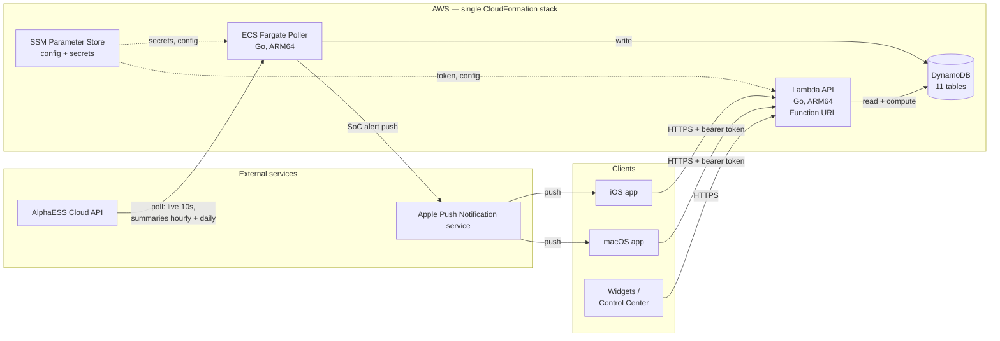
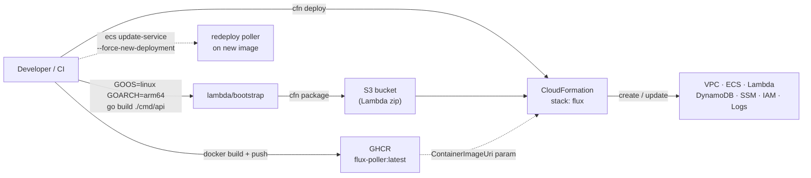
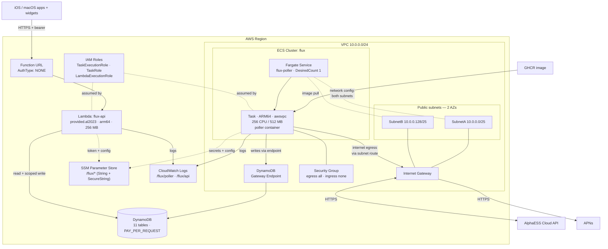
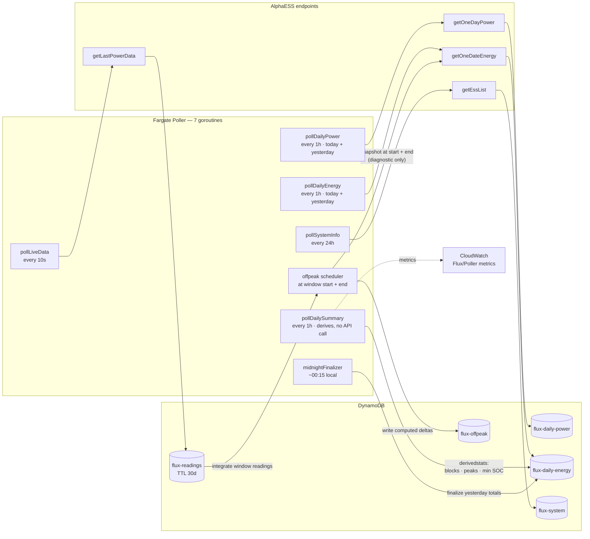
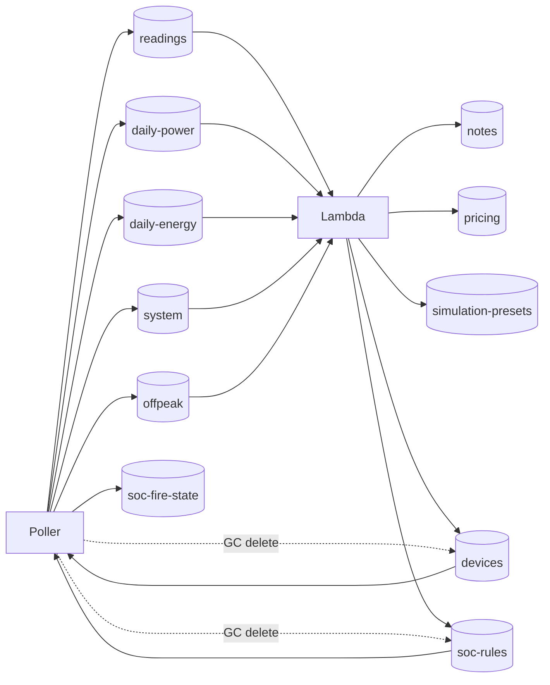
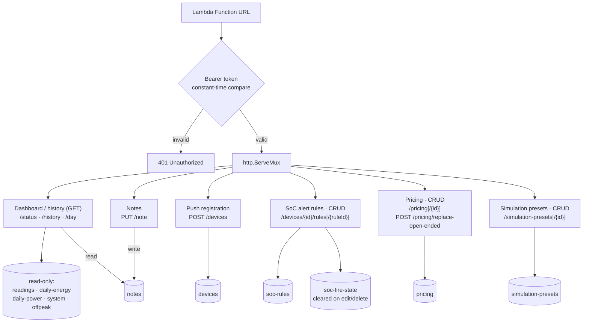
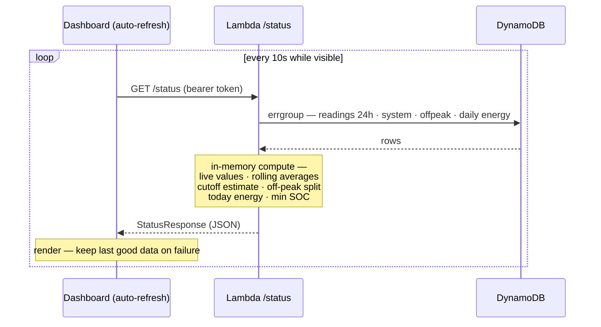
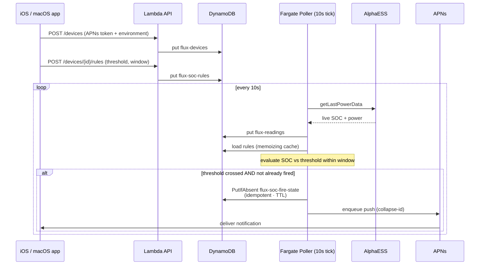

# Flux Architecture Diagrams

Visual reference for how Flux fits together end to end: the AWS backend, the
polling engine, the data model, the API, and the iOS/macOS clients. Diagrams are
[Mermaid](https://mermaid.js.org/) so they render on GitHub and stay editable in
source control. They double as source material for a write-up about the system.

All facts here are drawn from `infrastructure/template.yaml`, the Go services in
`cmd/` and `internal/`, and the apps under `Flux/`. Region is left generic — the
stack is region-agnostic, though `TZ=Australia/Sydney` is wired throughout.

---

## 1. System overview — how the pieces tie together

The app never talks to AlphaESS directly. A Fargate poller pulls from AlphaESS
and writes to DynamoDB; a Lambda reads DynamoDB and serves computed stats to the
apps. Push notifications flow back out through APNs.

Why it is shaped this way:

- **No API Gateway** — a Lambda Function URL is enough for a two-user app.
- **ARM64 everywhere** — Graviton on both Fargate and Lambda for cost.
- **One stack** — all infrastructure lives in a single CloudFormation template.

---

## 2. Build and deploy pipeline

The poller ships as a public container image on GHCR; the Lambda ships as a
zipped Go binary through CloudFormation. Configuration and secrets are passed as
stack parameters and SSM parameters.

SecureString SSM params (`/flux/app-secret`, `/flux/api-token`, the APNs key) are
created manually before the first deploy — CloudFormation cannot manage
SecureString values.

---

## 3. AWS infrastructure

The runtime topology. The poller runs as a single Fargate task in a public
subnet with egress to AlphaESS and APNs; DynamoDB is reached over a gateway VPC
endpoint rather than the internet. The Lambda sits outside the VPC behind a
public Function URL and does its own bearer-token auth.

The Fargate **service** is configured across both AZ subnets; with
`DesiredCount: 1` the running **task** resides in one AZ at a time — ECS picks the
AZ at placement (its ENI is governed by the security group). DynamoDB traffic stays inside AWS over the
gateway VPC endpoint; AlphaESS, APNs, and the GHCR image pull all leave through
the Internet Gateway. The VPC template also defines an S3 gateway endpoint, but
the poller has no runtime S3 path — it is not drawn here to avoid implying one.

IAM is least-privilege per role: the poller's `TaskRole` reads SoC rules/devices
and writes readings, summaries, off-peak, and fire-state; the
`LambdaExecutionRole` is read-only on the energy tables and write-scoped to the
user-authored tables (notes, devices, rules, pricing, presets) only.

---

## 4. The polling engine

The poller runs seven concurrent goroutines, each on its own schedule, each
mapping one AlphaESS endpoint to one DynamoDB table. A two-context pattern
(`loopCtx` stops the tickers on SIGTERM, `drainCtx` gives in-flight writes up to
25s) makes shutdown clean.

Notes that matter for correctness:

- **Live writes are guarded** — AlphaESS occasionally returns `200` with all-zero
  power overnight; the poller skips those so the dashboard never renders a fake
  live `0%` / `0 W`.
- **Today and yesterday both polled hourly** — yesterday is re-fetched so the
  final pre-midnight snapshots land before the day rolls over.
- **Off-peak energy is integrated from live readings** (post-T-1341) —
  `handleEnd` runs a strongly-consistent query of `flux-readings` over the
  configured window (e.g. 11:00–14:00) and sums the per-reading power deltas via
  `derivedstats.IntegrateOffpeakDeltas`, then writes the result to `flux-offpeak`.
  The `getOneDateEnergy` snapshots captured at window start/end are retained for
  diagnostics and drift logging only — they are not the basis of the computed
  value. This is why `g5` reads from `flux-readings` rather than following the
  `e3 → flux-daily-energy` path the other goroutines use.
- **`pollLiveData` also feeds SoC alerts** — the same 10s tick evaluates rules and
  writes `flux-soc-fire-state`, so the poller touches more than the five tables
  shown here. See diagram 8 for the full fire path.

---

## 5. DynamoDB data model

Eleven tables, all on-demand billing with `DeletionPolicy: Retain`. Only
`flux-readings` and `flux-soc-fire-state` expire rows via TTL; everything else is
kept. User-authored data carries point-in-time recovery (PITR). `flux-daily-power`
is reconstructable but deliberately retained so Day Detail charts work for any
historical date.

| Table | Partition / Sort | Retention | Writer | Reader |
|---|---|---|---|---|
| `flux-readings` | `sysSn` / `timestamp` | TTL 30d | Poller (live 10s) | Lambda |
| `flux-daily-power` | `sysSn` / `uploadTime` | retained | Poller (hourly) | Lambda (Day Detail fallback) |
| `flux-daily-energy` | `sysSn` / `date` | retained | Poller (hourly + summary + finalizer) | Lambda |
| `flux-system` | `sysSn` | retained | Poller (24h) | Lambda |
| `flux-offpeak` | `sysSn` / `date` | retained | Poller (window diff) | Lambda |
| `flux-notes` | `sysSn` / `date` | PITR | Lambda (`PUT /note`) | Lambda |
| `flux-devices` | `deviceId` | PITR | Lambda + Poller (GC) | Poller (eval) |
| `flux-soc-rules` | `deviceId` / `ruleId` | PITR | Lambda | Poller (eval) |
| `flux-soc-fire-state` | `deviceRule` / `windowStartDate` | TTL 7d | Poller (idempotent) | Poller |
| `flux-pricing` | `pricingId` | PITR | Lambda | Lambda |
| `flux-simulation-presets` | `presetId` | PITR | Lambda | Lambda |

Write ownership is deliberately split — the poller and the Lambda never share a
write path on the same table except for the SoC tables, where the Lambda owns
rule/device CRUD and the poller owns fire-state.

---

## 6. Lambda API surface

The Function URL accepts no auth at the AWS layer (`AuthType: NONE`); the handler
does bearer-token auth itself with a constant-time compare, before routing. Auth
runs ahead of routing so an invalid token gets `401` on every path. Routing is a
standard `http.ServeMux` with method+path patterns.

The three read endpoints are the only ones the dashboard, history, and day-detail
screens depend on. The rest are CRUD for user-authored data (notes, alert rules,
pricing, load presets) and device registration for push.

---

## 7. Dashboard refresh sequence

The dashboard auto-refreshes every 10s while visible (60s when the macOS window is
inactive). Each `/status` call fans out four concurrent DynamoDB queries, then
does all derivation in memory before returning one JSON payload.

(The day's note is fetched alongside this, via `fetchNoteAsync`, concurrently but
outside the errgroup so a notes-table failure can't cancel the core queries.)

A shared-metric rule applies across screens: any value shown on more than one
screen (e.g. today's peak grid import) is computed once — server-side where
possible — so the Dashboard, Day Detail, and History never disagree.

---

## 8. SoC alert push flow

Devices register their APNs token and create threshold rules through the Lambda.
The poller's 10s live tick evaluates each reading against the cached rules; when a
threshold is crossed inside its window and hasn't already fired, it writes an
idempotent fire-state row and enqueues a push.

Idempotency comes from the fire-state table: `PutIfAbsent` keyed on
`deviceRule` + `windowStartDate` ensures a rule fires at most once per window even
though the evaluator runs every 10s. The APNs environment is carried per device,
so a TestFlight build and an Xcode debug build coexist correctly.

---

## Maintaining these diagrams

- Schedules and goroutine wiring: `internal/poller/poller.go` (`Run`)
- AlphaESS endpoints: `internal/alphaess/client.go`
- Poller entry point + SoC-alert wiring: `cmd/poller/main.go`, `cmd/poller/socalerts.go`
- API routes: `internal/api/handler.go` (`buildMux`)
- `/status` fan-out and compute: `internal/api/status.go`
- Tables, keys, retention: `infrastructure/template.yaml`
- IAM scoping: the three roles in `infrastructure/template.yaml`
- App refresh behaviour: `Flux/Flux/Dashboard/DashboardViewModel.swift`

When any of these change, update the matching diagram in this file.
