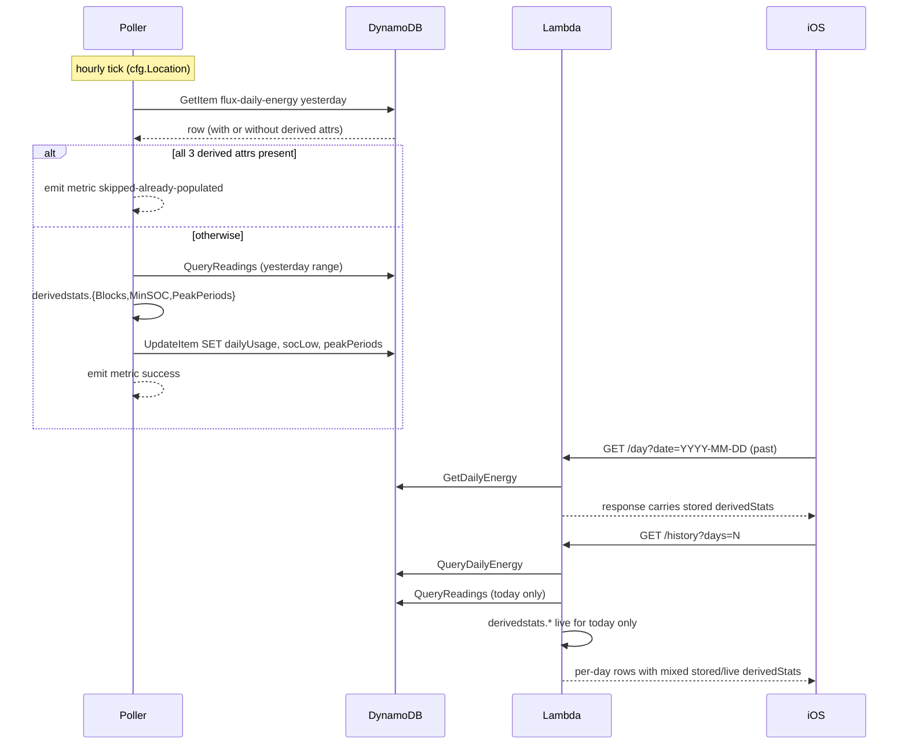

# Design: Daily Derived Stats

## Overview

Move three reading-derived per-day stats (`findDailyUsage`, `findMinSOC`, `findPeakPeriods`) into a shared `internal/derivedstats` package, add an hourly poller pass that summarises yesterday's readings into `flux-daily-energy` via `UpdateItem`, and update `/day` and `/history` to read derivedStats from storage for completed dates while preserving live computation for today and the existing `flux-daily-power` fallback for old dates.

## Architecture

### Package layout

```
internal/
├── derivedstats/        ← NEW. Pure functions over readings + types.
│   ├── blocks.go        (findDailyUsage + DailyUsage / DailyUsageBlock)
│   ├── peakperiods.go   (findPeakPeriods + PeakPeriod)
│   ├── socmin.go        (findMinSOC + SocLow type)
│   ├── melbourne.go     (melbourneSunriseSunset + sunrise/sunset table)
│   ├── integrate.go     (integratePload + maxPairGapSeconds)
│   └── *_test.go
├── api/                 ← imports derivedstats; thin call sites in day.go, history.go
├── poller/              ← imports derivedstats; new dailysummary.go
└── dynamo/              ← schema extension only; UpdateItem methods
```

`internal/derivedstats` exports the helpers and the types they return (`DailyUsage`, `DailyUsageBlock`, `PeakPeriod`, `SocLow`, plus a local `Reading` struct mirroring the `dynamo.ReadingItem` fields the helpers actually consume — see Decision 9). `internal/api` re-exports nothing — its existing public types (`DailyUsage` etc. in `response.go`) are deleted and the response shape is built directly from the `derivedstats` types. The constants `preSunriseBlipBuffer`, `recentSolarThreshold`, and the `pendingBlock` sentinel struct move with `findDailyUsage`.

**Layering invariant** (from Decision 9): `internal/derivedstats` imports nothing from other Flux packages. `internal/dynamo` imports `internal/derivedstats` (for the `*Attr ↔ derivedstats.*` conversion functions in a new file `derived_conv.go`, and for the `DerivedStats` bundle struct passed to `UpdateDailyEnergyDerived`). The three call sites (`day.go`, `history.go`, `dailysummary.go`) convert `[]dynamo.ReadingItem` → `[]derivedstats.Reading` before invoking the helpers, via a one-line `slices.Map`-style helper.

### End-to-end flow



### Off-peak source

The poller already loads `OffpeakStart` / `OffpeakEnd` as `time.Duration` from env vars at startup (`internal/config/config.go`, validated by `Load()`). The summarisation pass calls `config.FormatHHMM(cfg.OffpeakStart)` / `config.FormatHHMM(cfg.OffpeakEnd)` to produce the `"HH:MM"` strings that `derivedstats.Blocks` expects. AC 1.6's "skip when unresolved" path triggers when both formatted strings are empty / unparseable — the pass passes them through `derivedstats.ParseOffpeakWindow` and skips the write when that returns `!ok`. With the existing `Load()` validation, this path is dead code in production; it stays as a defensive guard with the metric dimension acting as a "should never happen, alarm if it does" signal (see Decision 7's negative-consequences note).

The Lambda likewise uses `os.Getenv("OFFPEAK_START")` at startup. The cross-handler equivalence contract from requirements [3.6] / [4.10] tolerates the in-flight config-change window between a Lambda redeploy and a poller redeploy.

**iOS read-side behaviour during the off-peak SSM in-flight gap** (per AC 4.10): the iOS app decodes whatever `dailyUsage` shape the response carries — block boundaries computed against either the old or the new off-peak window decode identically (the field shape is the same; only the block boundaries shift). The History card and Day Detail card render the response as-is. There is no client-side cross-check for "did `/day` and `/history` agree" — the iOS app trusts each response independently. A user who refreshes both the Dashboard (`/status` + Day Detail) and the History tab during the gap window may see slightly different block boundaries between the two; this is acceptable because the gap closes within one poller tick after the redeploy.

### Time-to-populate worst case for "yesterday"

AC [1.13](#1.13) bounds the worst case for a fresh container starting after midnight. The naive bound is "next hourly tick of both this pass and `pollDailyEnergy`" (≤1 hour after both have succeeded). The actual worst case is longer because of the existing `isAllZeroEnergy` skip in `pollDailyEnergy` (`internal/poller/poller.go:184`) — AlphaESS returns all-zero for "yesterday" until its finalisation window closes (extends past Sydney midnight by an unknown duration, observed in production at up to ~90 minutes). The realistic worst case for a fresh-after-midnight container is therefore "AlphaESS finalisation tail + one hourly tick + one summarisation tick" — a 2-3 hour window in pathological cases. This is well within the 30-day TTL budget and well within the 24-hour CloudWatch alarm window proposed earlier.

### Pattern Extension Audit

Adding the `internal/derivedstats` package replaces the existing `findDailyUsage` / `findMinSOC` / `findPeakPeriods` in `internal/api/compute.go`. Every call site of these helpers and their related types must be migrated.

Line numbers below are approximate (verify against the live file at implementation time; the audit was assembled from grep output).

| Symbol | Location | Action |
|---|---|---|
| `findDailyUsage` | `internal/api/day.go` (~line 80) | Replace call with `derivedstats.Blocks(toDerivedReadings(readings), offpeakStart, offpeakEnd, date, today, now)` |
| `findMinSOC` | `internal/api/day.go` (~line 77) | Replace call with `derivedstats.MinSOC(toDerivedReadings(readings))` |
| `findPeakPeriods` | `internal/api/day.go` (~line 79) | Replace call with `derivedstats.PeakPeriods(toDerivedReadings(readings), offpeakStart, offpeakEnd)` |
| `findMinSOCFromPower` | `internal/api/day.go` (~line 91) | **Stays in `internal/api`** — operates on `DailyPowerItem` (different input shape, fallback path only) |
| `DailyUsage`, `DailyUsageBlock` types | `internal/api/response.go` | Move to `derivedstats`; `internal/api` references the moved types |
| `PeakPeriod` type | `internal/api/response.go` | Move to `derivedstats` |
| `melbourneSunriseSunset`, sun table | `internal/api/melbourne_sun_table.go` | Move to `derivedstats` |
| `integratePload`, `parseOffpeakWindow` | `internal/api/compute.go` | Move to `derivedstats` (private helpers) |
| `recentSolarThreshold`, `preSunriseBlipBuffer`, `pendingBlock` | `internal/api/compute.go` | Move to `derivedstats` |
| `*_test.go` for the moved functions | `internal/api/compute_test.go` | Move to `internal/derivedstats/*_test.go` (large file, will need splitting per file boundary) |

Call sites that **stay** in `internal/api`:
- `findMinSOCFromPower` (fallback for `flux-daily-power` rows)
- `nextOffpeakStart`, `findFirstSolar`, `findLastSolar`, `solarStillUp`, `reconcileEnergy`, `computeTodayEnergy` — none of these are reading-derived stats; they are status / energy reconciliation helpers used by `/status` and `/history`'s today-energy reconciliation, not by `derivedstats`.

## Components and Interfaces

### `internal/derivedstats`

```go
package derivedstats

// Reading mirrors the subset of dynamo.ReadingItem fields the helpers consume.
// Defined here (instead of importing dynamo) to keep this package leaf-pure
// per Decision 9. If the storage shape adds a new reading field a helper
// needs, both types must be kept in sync — call sites convert via a
// mechanical slice mapping (see toDerivedReadings in day.go / history.go /
// dailysummary.go).
type Reading struct {
    Timestamp int64
    Ppv       float64
    Pload     float64
    Soc       float64
    Pbat      float64
    Pgrid     float64
}

// Blocks computes the five-block daily-usage breakdown.
//
// The (date, today, now) tuple drives the today-gate, future-omit, and
// in-progress clamp from peak-usage-stats AC 1.8. For a poller summarisation
// pass, callers MUST pass date == today so the today-gate cannot fire (the
// pass only ever runs against completed dates per requirements 1.2).
//
// Returns nil when no blocks survive the pipeline (no readings, or all
// degenerate after clamping). Per Decision 8 the storage layer pairs Blocks
// with a sentinel attribute, so a returned nil is correctly distinguished
// from "never computed" without re-running every hour.
func Blocks(readings []Reading, offpeakStart, offpeakEnd, date, today string, now time.Time) *DailyUsage

// MinSOC returns the lowest SOC reading of the day and its UTC unix timestamp.
// found=false when readings is empty.
func MinSOC(readings []Reading) (soc float64, timestampUnix int64, found bool)

// PeakPeriods returns the top high-consumption windows outside the off-peak
// window, sorted by avgLoad desc then start asc. Returns nil when readings
// is empty or the off-peak window is unparseable; returns an empty slice
// (not nil) when readings exist but no excursions qualify (e.g. cloudy day).
func PeakPeriods(readings []Reading, offpeakStart, offpeakEnd string) []PeakPeriod

// ParseOffpeakWindow returns true when both inputs parse as "HH:MM" with
// start < end. Re-exported so the poller can gate the summarisation pass
// per AC 1.6.
func ParseOffpeakWindow(start, end string) (startMin, endMin int, ok bool)

type DailyUsage struct {
    Blocks []DailyUsageBlock
}

type DailyUsageBlock struct {
    Kind             string  // "night" | "morningPeak" | "offPeak" | "afternoonPeak" | "evening"
    Start            string  // RFC3339 UTC
    End              string  // RFC3339 UTC
    TotalKwh         float64
    AverageKwhPerHour *float64
    PercentOfDay     int
    Status           string  // "complete" | "in-progress"
    BoundarySource   string  // "readings" | "estimated"
}

type PeakPeriod struct {
    Start    string  // RFC3339 UTC
    End      string  // RFC3339 UTC
    AvgLoadW float64
    EnergyWh float64
}

type SocLow struct {
    Soc           float64
    TimestampUnix int64
}
```

`derivedstats` has zero Flux-internal imports — see Decision 9. The `Reading` shadow struct and a one-line `toDerivedReadings([]dynamo.ReadingItem) []derivedstats.Reading` helper at each of the three call sites pays a small boilerplate cost to keep the layering provable.

### `internal/poller` — new file `dailysummary.go`

```go
const dailySummaryInterval = time.Hour

// pollDailySummary runs derivedStats summarisation for "yesterday" once per hour.
func (p *Poller) pollDailySummary(loopCtx, drainCtx context.Context, wg *sync.WaitGroup) {
    pollLoop(loopCtx, drainCtx, wg, dailySummaryInterval, p.summariseYesterday)
}

// summariseYesterday is the per-tick body. Idempotent (precheck) and bounded
// (single-system, single-date). Returns a metric dimension; logs side-effects
// only.
func (p *Poller) summariseYesterday(ctx context.Context) {
    yesterday := p.now().In(p.cfg.Location).AddDate(0, 0, -1).Format(dateLayout)
    result := p.runSummarisationPass(ctx, yesterday)
    p.metrics.RecordSummarisationPass(result)
}

// runSummarisationPass returns the metric dimension value for one pass.
func (p *Poller) runSummarisationPass(ctx context.Context, date string) string {
    // 1. precheck (AC 1.10) — sentinel attribute presence is the only signal.
    item, err := p.store.GetDailyEnergy(ctx, p.cfg.Serial, date)
    switch {
    case err != nil:
        slog.Error("summary precheck failed", "date", date, "error", err)
        return "error"
    case item == nil:
        return "skipped-no-row"          // AC 1.4
    case item.DerivedStatsComputedAt != "":
        return "skipped-already-populated" // AC 1.10 / Decision 8
    }

    // 2. Off-peak window resolution (AC 1.6 / 1.14). In the current poller
    //    architecture this is a defensive guard — cfg.OffpeakStart/End are
    //    validated at startup and cannot become invalid at runtime, so this
    //    path should never fire in production. If a future change introduces
    //    per-tick SSM resolution, this becomes load-bearing.
    offpeakStart := config.FormatHHMM(p.cfg.OffpeakStart)
    offpeakEnd := config.FormatHHMM(p.cfg.OffpeakEnd)
    if _, _, ok := derivedstats.ParseOffpeakWindow(offpeakStart, offpeakEnd); !ok {
        slog.Warn("summary skipped: off-peak unresolved", "date", date)
        return "skipped-ssm-unresolved"
    }

    // 3. fetch readings
    dayStart, _ := time.ParseInLocation(dateLayout, date, p.cfg.Location)
    dayEnd := dayStart.AddDate(0, 0, 1)
    rawReadings, err := p.store.QueryReadings(ctx, p.cfg.Serial, dayStart.Unix(), dayEnd.Unix()-1)
    if err != nil {
        slog.Error("summary readings query failed", "date", date, "error", err)
        return "error"
    }
    if len(rawReadings) == 0 {
        return "skipped-no-readings"
    }
    readings := toDerivedReadings(rawReadings) // []dynamo.ReadingItem -> []derivedstats.Reading

    // 4. compute (today=date forces the completed-day branch in derivedstats.Blocks)
    socLow, socLowTS, found := derivedstats.MinSOC(readings)
    derived := dynamo.DerivedStats{
        DailyUsage:             derivedstats.Blocks(readings, offpeakStart, offpeakEnd, date, date, p.now()),
        SocLow:                 socLowAttrFrom(socLow, socLowTS, found), // *dynamo.SocLowAttr (RFC3339)
        PeakPeriods:            derivedstats.PeakPeriods(readings, offpeakStart, offpeakEnd),
        DerivedStatsComputedAt: p.now().UTC().Format(time.RFC3339),
    }

    // 5. write — single SET expression covers all four attributes atomically.
    if err := p.store.UpdateDailyEnergyDerived(ctx, p.cfg.Serial, date, derived); err != nil {
        slog.Error("summary write failed", "date", date, "error", err)
        return "error"
    }
    return "success"
}

// toDerivedReadings is the cycle-breaking conversion per Decision 9. Three
// near-identical copies live in day.go, history.go, and dailysummary.go;
// duplication is preferred over a shared helper that would re-introduce
// a `dynamo` ↔ `derivedstats` import edge.
func toDerivedReadings(in []dynamo.ReadingItem) []derivedstats.Reading {
    out := make([]derivedstats.Reading, len(in))
    for i, r := range in {
        out[i] = derivedstats.Reading{
            Timestamp: r.Timestamp,
            Ppv:       r.Ppv,
            Pload:     r.Pload,
            Soc:       r.Soc,
            Pbat:      r.Pbat,
            Pgrid:     r.Pgrid,
        }
    }
    return out
}
```

The pass is added to `Run` alongside the existing four loops, and the existing `wg.Add` count in `Run` is bumped from 5 to 6:
```go
wg.Add(6)  // bumped from 5 — pollDailySummary added
go p.pollDailySummary(ctx, drainCtx, &wg)
```

`dailySummaryInterval` joins the existing constant block at the top of `poller.go` (next to `livePollInterval`, `dailyEnergyInterval`, etc.) for consistency with the existing pattern.

### `internal/poller/metrics` — thin CloudWatch shim

```go
// CloudWatchAPI is the subset of the SDK client used. Easily faked for tests.
type CloudWatchAPI interface {
    PutMetricData(ctx context.Context, in *cloudwatch.PutMetricDataInput, optFns ...func(*cloudwatch.Options)) (*cloudwatch.PutMetricDataOutput, error)
}

type Metrics struct {
    client    CloudWatchAPI
    namespace string  // "Flux/Poller"
}

// RecordSummarisationPass emits one data point with Result dimension.
// Failures to publish are logged but never returned (metrics MUST NOT
// affect poller availability).
func (m *Metrics) RecordSummarisationPass(result string) { ... }
```

In dry-run mode, `Metrics` is a no-op stub (no AWS calls).

### `internal/dynamo` — schema and store changes

```go
// DailyEnergyItem extension (additive).
type DailyEnergyItem struct {
    SysSn       string  `dynamodbav:"sysSn"`
    Date        string  `dynamodbav:"date"`
    Epv         float64 `dynamodbav:"epv"`
    EInput      float64 `dynamodbav:"eInput"`
    EOutput     float64 `dynamodbav:"eOutput"`
    ECharge     float64 `dynamodbav:"eCharge"`
    EDischarge  float64 `dynamodbav:"eDischarge"`
    EGridCharge float64 `dynamodbav:"eGridCharge"`

    // NEW — optional, native Map / List / String per AC 2.1.
    DailyUsage             *DailyUsageAttr  `dynamodbav:"dailyUsage,omitempty"`
    SocLow                 *SocLowAttr      `dynamodbav:"socLow,omitempty"`
    PeakPeriods            []PeakPeriodAttr `dynamodbav:"peakPeriods,omitempty"`
    DerivedStatsComputedAt string           `dynamodbav:"derivedStatsComputedAt,omitempty"` // sentinel; presence means "summarised", per Decision 8
}

// DerivedStats bundles the four attributes the summarisation pass writes.
// Lives in `dynamo` (not `poller`) per Decision 9 — it's a storage-write
// argument, not a poller-only concept.
type DerivedStats struct {
    DailyUsage             *DailyUsageAttr
    SocLow                 *SocLowAttr
    PeakPeriods            []PeakPeriodAttr
    DerivedStatsComputedAt string
}

type DailyUsageAttr struct {
    Blocks []DailyUsageBlockAttr `dynamodbav:"blocks"`
}

type DailyUsageBlockAttr struct {
    Kind              string   `dynamodbav:"kind"`
    Start             string   `dynamodbav:"start"`
    End               string   `dynamodbav:"end"`
    TotalKwh          float64  `dynamodbav:"totalKwh"`
    AverageKwhPerHour *float64 `dynamodbav:"averageKwhPerHour,omitempty"`
    PercentOfDay      int      `dynamodbav:"percentOfDay"`
    Status            string   `dynamodbav:"status"`
    BoundarySource    string   `dynamodbav:"boundarySource"`
}

type SocLowAttr struct {
    Soc       float64 `dynamodbav:"soc"`
    Timestamp string  `dynamodbav:"timestamp"` // RFC3339 UTC
}

type PeakPeriodAttr struct {
    Start    string  `dynamodbav:"start"`
    End      string  `dynamodbav:"end"`
    AvgLoadW float64 `dynamodbav:"avgLoadW"`
    EnergyWh float64 `dynamodbav:"energyWh"`
}

// The AC 1.10 precheck is a single attribute existence check on
// DerivedStatsComputedAt — no method is needed, the call site reads the
// field directly. See Decision 8 for why a sentinel beats inspecting the
// three derived attributes.
```

The `*Attr` types are intentionally separate from `derivedstats.*` so the storage shape is independent of the in-process types — same reasoning as keeping `DailyPowerItem` separate from `TimeSeriesPoint`. Conversion functions live in a new file `internal/dynamo/derived_conv.go`:

```go
func DailyUsageFromAttr(a *DailyUsageAttr) *derivedstats.DailyUsage
func DailyUsageToAttr(d *derivedstats.DailyUsage) *DailyUsageAttr
// ... and similar for SocLow and PeakPeriods
```

**Store API changes:**

```go
// WriteDailyEnergy migrates from PutItem to UpdateItem (Decision 3).
// Sets only the energy fields — leaves derived attributes untouched.
func (s *DynamoStore) WriteDailyEnergy(ctx context.Context, item DailyEnergyItem) error

// NEW. UpdateItem SET on the four derived attributes (three payloads + sentinel).
func (s *DynamoStore) UpdateDailyEnergyDerived(
    ctx context.Context, sysSn, date string, derived DerivedStats,
) error

// NEW. GetItem for the precheck. Reuses the same row read used by handleDay.
func (s *DynamoStore) GetDailyEnergy(ctx context.Context, sysSn, date string) (*DailyEnergyItem, error)
```

`UpdateDailyEnergyDerived` builds an UpdateItem with this SET expression:
```
SET dailyUsage = :du, socLow = :sl, peakPeriods = :pp, derivedStatsComputedAt = :ts
```
Four values, four attribute writes, atomic per DynamoDB item. `WriteDailyEnergy` builds a parallel SET expression for the energy fields:
```
SET epv = :epv, eInput = :ei, eOutput = :eo, eCharge = :ec, eDischarge = :ed, eGridCharge = :egc
```

**Future-proofing the energy SET expression** (per design-critic Q3): the SET expression hard-codes six fields. A future field added to `DailyEnergyItem` (in the AlphaESS-energy section) without updating this SET would silently drop on every write — a regression `PutItem` did not have. Mitigation: a unit test in `internal/dynamo` walks the `DailyEnergyItem` struct via `reflect.Type`, collects the `dynamodbav` tag names of fields that are NOT in the derivedStats set (`dailyUsage`, `socLow`, `peakPeriods`, `derivedStatsComputedAt`) and NOT key fields (`sysSn`, `date`), and asserts every one of them appears in the `WriteDailyEnergy` SET expression. This is part of AC 6.3 and is the regression guard for "I forgot to update the SET expression after adding a field."

The `LogStore` (dry-run) gains the same two methods as no-ops that log the would-be write payload.

### `internal/api` — read-side changes

`/day` (`day.go`):
```go
isToday := date == today
if !isToday {
    // Past date path — read derivedStats from storage.
    // Skip the QueryReadings goroutine entirely.
    if deItem != nil {
        if deItem.DailyUsage != nil {
            dailyUsage = dynamo.DailyUsageFromAttr(deItem.DailyUsage)
        }
        if deItem.SocLow != nil {
            socLow = deItem.SocLow.Soc
            socLowTime = parseRFC3339(deItem.SocLow.Timestamp)
            hasReadings = true   // socLow availability gates summary section
        }
        peakPeriods = peakPeriodsFromAttr(deItem.PeakPeriods)
    }
    // QueryDailyPower fallback path stays unchanged for past dates with no
    // readings (and now also unchanged for past dates with no derived stats):
    // if readings == nil and deItem has no socLow, fall back to daily-power
    // for the chart and SOC low.
} else {
    // Today path — existing live compute, unchanged.
}
```

`/history` (`history.go`):
```go
for i, item := range items {
    // ... existing energy reconciliation ...
    isItemToday := item.Date == today
    if !isItemToday {
        if item.DailyUsage != nil { day.DailyUsage = dynamo.DailyUsageFromAttr(item.DailyUsage) }
        if item.SocLow != nil { day.SocLow = ...; day.SocLowTime = ... }
        if item.PeakPeriods != nil { day.PeakPeriods = ... }
    } else if len(allReadings) > 0 {
        // Today: live compute against the slice already loaded for energy reconciliation.
        day.DailyUsage  = derivedstats.Blocks(allReadings, h.offpeakStart, h.offpeakEnd, today, today, now)
        soc, ts, found := derivedstats.MinSOC(allReadings)
        if found { day.SocLow = soc; day.SocLowTime = formatRFC3339(ts) }
        day.PeakPeriods = derivedstats.PeakPeriods(allReadings, h.offpeakStart, h.offpeakEnd)
    }
    // AC 4.9: when the today-readings query failed (allReadings == nil despite
    // isItemToday), the live-compute branch is skipped silently — the today
    // row carries energy totals only. The error was already logged by the
    // existing QueryReadings goroutine.
}
```

### iOS — `Flux/Packages/FluxCore/Sources/FluxCore/Models/APIModels.swift`

```swift
public struct DayEnergy: Codable, Sendable, Identifiable {
    // existing fields unchanged...

    // NEW — optional, decode to nil when absent.
    public let dailyUsage: DailyUsage?
    public let socLow: Double?
    public let socLowTime: String?
    public let peakPeriods: [PeakPeriod]?

    // ... existing init gets four additional optional parameters with nil
    // defaults so existing callsites compile unchanged.
}
```

The `DailyUsage` and `PeakPeriod` types already exist in the file (used by `DayDetailResponse`); no new types are introduced.

**Wire shape note** (per explain-like finding): the `socLow` / `socLowTime` field placement differs between the two endpoints by historical accident:
- `/day` carries them under `summary.socLow` / `summary.socLowTime` (existing `DaySummary` struct, unchanged).
- `/history` carries them flat on each `DayEnergy` row (new fields per this spec).

The Lambda's `/day` handler converts the storage `dynamo.SocLowAttr{Soc, Timestamp string}` → `summary.socLow + summary.socLowTime` for past dates the same way the live path already does. The `/history` handler populates the flat fields directly on each `DayEnergy`. The iOS client decodes the two surfaces independently — `DaySummary` for `/day`, `DayEnergy` for `/history` — and consumers of the History card pick from the flat fields.

**Storage ↔ wire conversion**: `derivedstats.MinSOC` returns `(soc, unixTimestamp int64, found bool)`. The dynamo store wraps it into `SocLowAttr{Soc: float64, Timestamp: time.Unix(unixTimestamp, 0).UTC().Format(time.RFC3339)}`. The Lambda reads the `SocLowAttr` and re-publishes the RFC3339 string as-is (no re-parsing). This single int64 → RFC3339 conversion happens once at write time and never again.

### iOS — `CachedDayEnergy` round-trip

```swift
@Model
public final class CachedDayEnergy {
    // existing fields unchanged...

    // NEW — Codable bag stored as Data via @Attribute(.transformable)
    // is avoided; instead use three optional Codable properties that
    // SwiftData can persist directly.
    public var dailyUsage: DailyUsage?
    public var socLow: Double?
    public var socLowTime: String?
    public var peakPeriods: [PeakPeriod]?

    public init(from day: DayEnergy) {
        // assign three new fields from `day`
    }

    public var asDayEnergy: DayEnergy {
        DayEnergy(
            // existing args...
            dailyUsage: dailyUsage,
            socLow: socLow,
            socLowTime: socLowTime,
            peakPeriods: peakPeriods
        )
    }
}
```

The empirical no-migration verification (AC 5.5): the implementation runs the simulator with a pre-feature SwiftData store on disk, launches the new build, and confirms the existing rows load with the new properties as `nil` and no `ModelContainer` initialisation error. If SwiftData reports a schema mismatch, a `VersionedSchema` lightweight migration is added (per AC 5.5's fail criterion).

**Pre-flight checks before claiming "trivial migration"** (per design-critic Q11):
1. Confirm `CachedDayEnergy` has no `@Relationship` properties — relationship-graph migrations are notoriously fiddly and would invalidate the "usually no-op" claim.
2. Confirm the existing `DailyUsage`, `DailyUsageBlock`, and `PeakPeriod` types in `FluxCore/Models/APIModels.swift` are pure Codable structs (no enums with associated values, no closures, no custom Date decoders that depend on a specific `JSONDecoder.dateDecodingStrategy`).
Both checks are mechanical reads of the existing files; if either fails, the lightweight migration becomes mandatory rather than fallback.

### CloudFormation — new IAM grants

```yaml
# Adding to PollerTaskRole policies (single CFN update, atomic with ECS task swap):
- PolicyName: DerivedStatsWritePolicy
  PolicyDocument:
    Statement:
      - Effect: Allow
        Action: dynamodb:UpdateItem
        Resource: !GetAtt DailyEnergyTable.Arn
      - Effect: Allow
        Action: cloudwatch:PutMetricData
        Resource: "*"  # PutMetricData has no resource-level permissions
        Condition:
          StringEquals:
            cloudwatch:namespace: "Flux/Poller"
```

`cloudwatch:PutMetricData` does not support resource-level permissions, so `Resource: "*"` is required. The `cloudwatch:namespace` condition key scopes the grant to a single namespace.

**Lambda IAM verification** (per design-critic Q9): before implementation, confirm that `infrastructure/template.yaml` already grants the Lambda `dynamodb:GetItem` (used by `handleDay`) and `dynamodb:Query` (used by `handleHistory`) on `flux-daily-energy`. If the existing grant is narrower (e.g. attribute-condition scoped, or restricted by index), the Lambda's IAM may need a small relaxation to read the new attributes. Cite the specific stanza in the implementation PR.

### CloudWatch alarm (operator-side, not part of this spec's deliverable)

The `SummarisationPassResult` metric exists for operator monitoring. The recommended alarm — declared elsewhere or post-deploy — is "no `success` data point in the last 25 hours" (one full diurnal cycle plus an hour of buffer). The spec does not deliver the alarm itself because the alarm thresholds depend on operator preference and SNS topic wiring that is out of scope.

## Data Models

Already covered above (`DailyEnergyItem` extension, `*Attr` storage types, `derivedstats` types). No new tables, no GSIs, no schema changes outside this row.

Storage shape on disk for one row (illustrative, native DynamoDB JSON):

```json
{
  "sysSn": {"S": "AL...123"},
  "date":  {"S": "2026-04-28"},
  "epv":   {"N": "32.4"},
  "eInput": {"N": "8.2"},
  "...": "...",
  "dailyUsage": {"M": {
    "blocks": {"L": [
      {"M": {
        "kind":           {"S": "night"},
        "start":          {"S": "2026-04-27T14:00:00Z"},
        "end":            {"S": "2026-04-27T20:30:00Z"},
        "totalKwh":       {"N": "1.8"},
        "percentOfDay":   {"N": "12"},
        "status":         {"S": "complete"},
        "boundarySource": {"S": "readings"}
      }},
      "..."
    ]}
  }},
  "socLow": {"M": {"soc": {"N": "18"}, "timestamp": {"S": "2026-04-28T19:45:00Z"}}},
  "peakPeriods": {"L": [
    {"M": {"start": {"S": "..."}, "end": {"S": "..."}, "avgLoadW": {"N": "..."}, "energyWh": {"N": "..."}}}
  ]}
}
```

## Error Handling

| Failure | Detected by | Behaviour | Metric dimension |
|---|---|---|---|
| Yesterday row absent | `GetDailyEnergy` returns nil | Skip pass; next AlphaESS energy poll creates the row | `skipped-no-row` |
| `derivedStatsComputedAt` sentinel present | `item.DerivedStatsComputedAt != ""` | Skip the readings query and the write | `skipped-already-populated` |
| Off-peak window unparseable | `derivedstats.ParseOffpeakWindow` returns `!ok` | Skip; log warn | `skipped-ssm-unresolved` |
| Readings query empty | `len(readings) == 0` | Skip; log info | `skipped-no-readings` |
| Readings query error | non-nil err | Log error; no write | `error` |
| `UpdateItem` error | non-nil err | Log error; no metric for partial success (the SET is a single atomic op) | `error` |
| CloudWatch `PutMetricData` error | non-nil err | Log warn; do not affect the pass result (metrics are observability, not load-bearing) | n/a |
| `/history` today readings fail | existing handler logs | Today row's derivedStats omitted; rest of range served (AC 4.9) | n/a |

## Testing Strategy

### Unit tests by package

| Package | Coverage |
|---|---|
| `internal/derivedstats` | All existing tests for `findDailyUsage` / `findMinSOC` / `findPeakPeriods` migrate here unchanged (file-level move). The `peak-usage-stats` AC 4.1 fixture set continues to apply. |
| `internal/poller` | Per AC 6.1 / 6.2: the seven scenarios in 6.1 (success / no-readings / no-row / SSM-unresolved / readings-error / update-error / already-populated), idempotence (two consecutive passes on the same readings produce the same `UpdateItem` payload), and the precheck short-circuit (no `QueryReadings` issued when the row is fully populated). |
| `internal/dynamo` | Per AC 6.3: round-trip with energy-only writer; round-trip with summary-only writer on top; pre-feature legacy `PutItem` fixture decoded by post-feature code. The `*Attr` ↔ `derivedstats` conversion functions get their own focused tests. |
| `internal/api/day_test.go` | Per AC 6.4: completed-date with all three derived fields; one absent; all absent; completed-date with no readings AND no derivedStats but `flux-daily-power` available (regression for AC 3.5); today (live compute, unchanged); regression assertion that `/day` issues no `QueryReadings` for completed dates. |
| `internal/api/history_test.go` | Per AC 6.5: 7-day window where every day has all three; oldest day lacks derived fields; window straddling today (today live-computed). Regression for AC 4.9: today readings query fails, today row served with energy only. |
| Cross-handler | Per AC 6.6: equivalence test with a fixed clock asserting `/day` and `/history` return the same derivedStats for the same date. |
| End-to-end | Per AC 6.7: real DynamoDB surface (DynamoDB Local in CI). Stage readings + an existing energy row, run summarisation pass, then call `/day` and `/history` and assert the responses carry the expected derivedStats. |
| iOS `FluxCore` | Per AC 6.8: decode JSON with all three sections; decode JSON with none of them; `CachedDayEnergy` round-trip for both cases. The pre-feature cache load is verified empirically per AC 5.5. |

### Property-based testing assessment

Three properties from the requirements are good PBT candidates:

1. **Idempotence** ([1.8](#1.8)): for any valid readings slice + off-peak window, two consecutive `runSummarisationPass` invocations on the same inputs produce identical `UpdateItem` payloads (modulo Go map iteration order, which `cmp.Diff` ignores for maps).
2. **Precheck round-trip**: for any `derivedstats` output written via `UpdateDailyEnergyDerived` and read back via `GetDailyEnergy`, `HasAllDerivedStats()` returns `true`.
3. **Conversion round-trip**: for any `derivedstats.DailyUsage` value, `DailyUsageFromAttr(DailyUsageToAttr(d))` is field-equivalent to `d`. Same for `SocLow` and `PeakPeriods`.

Use `pgregory.net/rapid` (per the project's Go testing rules). Generators:
- `genReadings`: a slice of `dynamo.ReadingItem` with monotonically-increasing timestamps within a single Sydney calendar day, randomised power values within plausible bounds, length 0–1500.
- `genOffpeak`: pairs of `"HH:MM"` strings ranging from `"00:00"` to `"23:30"` plus a small fraction of unparseable values (to exercise the `!ok` path).
- `genDerivedStats`: hand-authored generators producing realistic-shape values (block counts 0–5, peak period counts 0–3).

Property-based tests live alongside the example-based tests in `internal/derivedstats` and `internal/dynamo`. The end-to-end and cross-handler tests stay example-based — their setup cost makes shrinking impractical.

### Test-stage gating

The end-to-end test (AC 6.7) requires DynamoDB Local. Per the project Go testing rules, gate it on `INTEGRATION=1` so `make check` keeps running fast in the default mode:

```go
func TestEndToEnd_DerivedStatsRoundTrip(t *testing.T) {
    if os.Getenv("INTEGRATION") == "" {
        t.Skip("set INTEGRATION=1 to run")
    }
    // ...
}
```

There is no existing `make integration` target; the implementation PR SHALL add one (or equivalent named target) that runs `INTEGRATION=1 go test ./...` against a DynamoDB Local container started by the same target. Without the target the e2e test still works locally via the env var; the Makefile entry is the CI-side ergonomics piece.

## Performance

Measurements per requirements [4.7](#4.7) and [4.8](#4.8) — to be captured during implementation, not asserted now:

- `/history?days=30` p95 baseline (capture pre-change).
- `/history?days=30` p95 post-change. Budget: +50 ms.
- Serialised `/history?days=30` payload size pre- and post-change. Budget: ≤3× baseline (target ~30 KB → ~60 KB).
- `flux-daily-energy` row size for one representative day with all three derivedStats. Budget: ≤4 KB total per row.

If any budget is exceeded the design SHALL be revisited rather than the budget silently relaxed.
